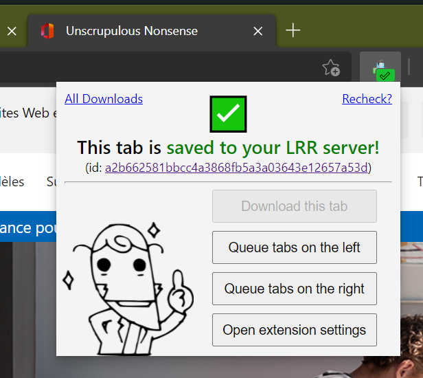

# Tsukihi

Tiny WebBrowser helper for . 🐦

## Features  

* Asks your LRR server whether it has downloaded the URL you're currently looking at  
* If not, provides quick shortcut buttons to queue the URL for downloading, or its left-side/right-side neighbors
* Downloaded URLs can be automatically added to a Category on the Server for your read-later scenarios

## Required LRR Server Version

* Basic URL Downloading: From **v.0.7.3** - _"Glass Spider"_ onwards.
* Full support: From **v.0.7.8** - _"Looking for Lester"_ onwards.

## Installation on Chrome and derivatives  

1. Clone or download this repo
2. Open the [Extensions page](chrome://extensions/) in your browser, enable developer mode
3. Click on the button for loading unpacked extensions (top left), select the Tsukihi directory to install it
4. Do the basic setup procedure to connect the extension to LANraragi (see below)

To update, just do git pull (or redownload the repo), then go to your browser's Extensions page and reload the extension. You will need to reload any tabs opened before the update to get the extension working correctly on those pages.

If you use Chrome, it will probably nag you about using an unpacked extension not from the Chrome Store. 

## Installation on Firefox (signed xpi)

0. Download the latest signed .xpi file from the [Releases](https://github.com/Difegue/Tsukihi/releases)
1. Open the extensions page in Firefox, then use the 'Install Add-on From File...' item from the gear menu
2. Do the basic setup procedure to connect the extension to LANraragi (see below)

## Installation on Firefox (running from git source)

0. A nightly/developer or unbranded edition of Firefox is required, since otherwise there is no way to install unsigned addons (fuck you, Mozilla!). Unbranded builds are the same as regular Firefox except for the lack of branding and that you can disable the
extension signing requirement, see [here](https://wiki.mozilla.org/Add-ons/Extension_Signing#Unbranded_Builds)
1. Clone this repo
2. Zip the contents of the hydrus-companion directory (but not the directory itself!) and change the extension of the zip file to xpi
3. Set xpinstall.signatures.required to false in Firefox about:config
4. Go to the extensions page and use the 'load extension from file' option to load the xpi
5. Do the basic setup procedure to connect the extension to LANraragi (see below)

## Basic setup - connecting the extension to LANraragi

1. Go to your Server Settings and add an API Key (or disable passwords entirely)
2. Make sure to also check "Enable CORS for the Client API" while you're in Settings
3. Open the extension's options page
4. Key in the server's URL (with scheme) and API Key, press the "Check Server" button to verify that the extension connects properly
5. Add a Category to associate downloaded URLs to. Categories are pulled from your server when you press the "Check Server" button.  
6. Save the extension settings and you're good to go!
